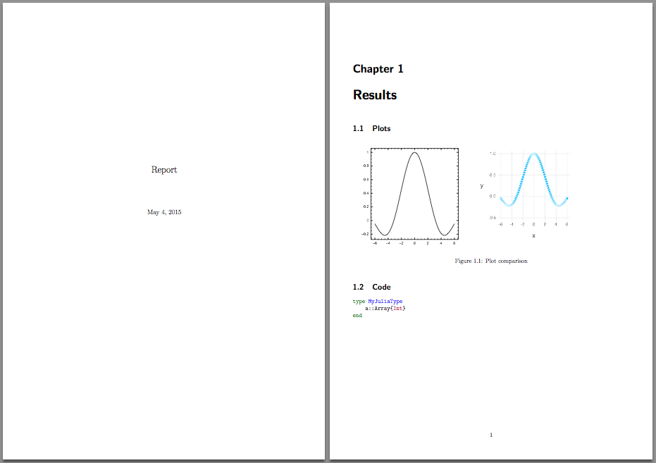

# LaTeX

[](https://travis-ci.org/rened/LaTeX.jl)
[](http://pkg.julialang.org/?pkg=LaTeX&ver=0.4)
[](http://pkg.julialang.org/?pkg=LaTeX&ver=0.5)


This package allows to construct LaTeX documents programmatically.

## Installation

It is assumed that you have `pdflatex` installed. You can then install `LaTeX.jl` like this:

```jl
]add LaTeX
```

To be able to use code blocks with syntax highlighting, please install [Pygments](http://pygments.org/): `easy_install -U Pygments`.

## Example


```jl
using LaTeX

x = range(-6,6; length=100)

using Gadfly
g = Image(7, 7, plot(x = x, y = sin.(x) ./ x, Geom.line))
w = Image(7, 7, plot(x = x, y = cos.(x)))

# needs pygments to be installed
c = Code("""
struct MyJuliaType
    a::Array{Int}
end
""")

openpdf(report(
    Section("Results", [
        Section("Plots", Figure("Plot comparison",Tabular([w,g]))),
        Section("Code", c)
])))
```



## Available functions

`content` can always be either a single item or an array of items.

* `latex = report(content)` assembles the LaTeX file
* `latex = document(content)` gives more control over the look and feel of
the document. See [here](#Advanced) for more.
* `openpdf(latex)` compiles the LaTeX file and tries to open it
* `writepdf(latex, filename)` compiles the LaTeX file and save it to the destination provided
* `Section(title, content)` creates a new section. A section is automatically translated to a Linux chapter, section or subsection according to its nesting
* `Figure(caption, content)`
* `Table(caption content)`
* `Tabular(content)`
* `Code(content)`
* `TOC()` indicates a table of contents
* `Abstract(content)` defines an abstract for the document
* `Image(height, width, Array or Winston.FramePlot or Gadfly.Plot)`, where the array can be either of size `(m,n,1)` or RGB `(m,n,3)`, with the values in the range `0..1`

## Advanced
To define a custom document, use the `document` function, in combination with
the following declarations, some of which can be omitted:

* `DocumentClass("article", ["11pt", "letterpaper"])`
declares the document class of the file. Settings are passed through a vector
as the second parameter.
* `Title("A LaTeX Library for Julia")` declares the title of the file.
* `Date(1999, 12, 31)` declares the date of the file. Note that this is the
same `Date` as in standard Julia.
* `Author("John Smith")` declares the author of the file.

For example, the following is a minimal document:

    document([
        DocumentClass("article", ["11pt", "letterpaper"]),
        Date(2015, 11, 23),
        Title("A LaTeX Library for Julia"),
        Author("John Smith"),
        Section("Code", [Code("""# minimal example""")])])

## Todos

* make preamble configurable
* adapt `openpdf` to linux
* add tests
